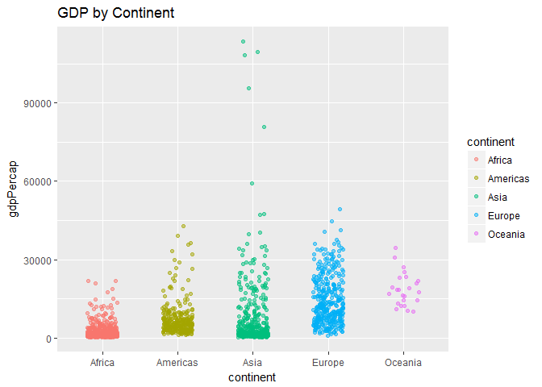

# hw03
Wade  
September 30, 2017  

In this assignment, I will be using dplyr and ggplot2 to explore the gapminder dataset.


```r
suppressPackageStartupMessages(library(gapminder))
```

```
## Warning: package 'gapminder' was built under R version 3.3.3
```

```r
suppressPackageStartupMessages(library(tidyverse))
```

```
## Warning: package 'tidyverse' was built under R version 3.3.3
```

```
## Warning: package 'ggplot2' was built under R version 3.3.2
```

```
## Warning: package 'tibble' was built under R version 3.3.2
```

```
## Warning: package 'tidyr' was built under R version 3.3.2
```

```
## Warning: package 'readr' was built under R version 3.3.3
```

```
## Warning: package 'purrr' was built under R version 3.3.3
```

```
## Warning: package 'dplyr' was built under R version 3.3.2
```

I have a list of tasks to choose from. I will do at least 3 of them.

<h4>Task 1</h4>
First, let's look at how life expectancy changes on different continents.


```r
class(gapminder$continent)
```

```
## [1] "factor"
```

```r
class(gapminder$lifeExp)
```

```
## [1] "numeric"
```

It's always good to check the class of the variables you are working with before you get started.


```r
g<-ggplot(gapminder, aes(x=continent, y=lifeExp))
g  + geom_jitter(alpha=.5, aes(color=continent), position=position_jitter(width=.2)) +
  labs(title="Overview of Continents")
```

<!-- -->
This is a good graph showing an overview of life expectancies across each continent. But is there more information that we can glean from this dataset to answer our original question?

I would like to know how the average life expectancy for each continent has changed over time.


```r
filter(gapminder, continent=="Africa") %>% 
  arrange(year) %>%
  ggplot(aes(lifeExp, year, color=(year))) +
  coord_flip()+
  geom_point()+
  scale_color_gradient(low="palegreen1", high="darkgreen")+
   theme(plot.background = element_rect(fill = 'grey'),plot.title = element_text(hjust = 0.5))+ # Center the title
  labs(title="Africa", x= "Life Expectancy", y= "Year") #These are actually switched because I originally used the coord_flip function
```

<!-- -->

This plot reveals something interesting. There was one entry that yielded a far lower life expectancy in Africa than all of the others. This may correspond to the <b>Rwandan genocide</b> in 1994.

Let's generate comparable graphs for each of the other continents.


```r
filter(gapminder, continent=="Americas") %>% 
  arrange(year) %>%
  ggplot(aes(lifeExp, year, color=(year))) +
  coord_flip()+
  geom_point()+
  scale_color_gradient(low="lightsteelblue1", high="slategrey")+
   theme(plot.background = element_rect(fill = 'snow2'),plot.title = element_text(hjust = 0.5), panel.border = element_rect(colour = "black", fill=NA, size=1))+ #added a border
  labs(title="Americas", x= "Life Expectancy", y= "Year")
```

<!-- -->
In the Americas, there is a constant, steady increase in life expectancy. This presents real issues to the social security program, which was started in 1935 when the average life expectancy was much lower.


```r
filter(gapminder, continent=="Asia") %>% 
  arrange(year) %>%
  ggplot(aes(lifeExp, year, color=(year))) +
  coord_flip()+
  geom_point()+
  scale_color_gradient(low="deeppink", high="maroon4")+
   theme(plot.background = element_rect(fill = 'snow2'),plot.title = element_text(hjust = 0.5), panel.border = element_rect(colour = "darkred", fill=NA, size=1))+ 
  labs(title="Asia", x= "Life Expectancy", y= "Year")
```

<!-- -->
Some of the countries in Asia appear to have had consistently low life expectancies compared to the rest of the continent. After some searching, I found that Cambodia had a civil war in the 1970s.

```r
cam<-filter(gapminder, country=="Cambodia")
knitr::kable(head(cam, format = "pandoc"))
```


country    continent    year   lifeExp       pop   gdpPercap
---------  ----------  -----  --------  --------  ----------
Cambodia   Asia         1952    39.417   4693836    368.4693
Cambodia   Asia         1957    41.366   5322536    434.0383
Cambodia   Asia         1962    43.415   6083619    496.9136
Cambodia   Asia         1967    45.415   6960067    523.4323
Cambodia   Asia         1972    40.317   7450606    421.6240
Cambodia   Asia         1977    31.220   6978607    524.9722

Here we can see a large drop from their 1972 life expecancy to their 1977 life expectancy corresponding to a genocide of between 1.5-3 million people.

On a lighter note, R only offers 4 shades of maroon. Now we know how Maroon 5 got its name!


```r
filter(gapminder, continent=="Europe") %>% 
  arrange(year) %>%
  ggplot(aes(lifeExp, year, color=(year))) +
  coord_flip()+
  geom_point()+
  scale_color_gradient(low="aquamarine", high="aquamarine4")+
  labs(title="Europe", x= "Life Expectancy", y= "Year")+
  theme_bw()+
  theme(plot.background = element_rect(fill = 'linen'),plot.title = element_text(hjust = 0.5), panel.border = element_rect(colour = "darkgreen", fill=NA, size=1)) 
```

<!-- -->

It looks like one country in Europe has trailed far behind the others. I wonder which one it is...?


```r
eur<-filter(gapminder, continent=="Europe") %>% 
  arrange(lifeExp)
knitr::kable(head(eur, n=20) %>% arrange(year), format = "pandoc")
```


country                  continent    year   lifeExp        pop   gdpPercap
-----------------------  ----------  -----  --------  ---------  ----------
Turkey                   Europe       1952    43.585   22235677   1969.1010
Bosnia and Herzegovina   Europe       1952    53.820    2791000    973.5332
Albania                  Europe       1952    55.230    1282697   1601.0561
Serbia                   Europe       1952    57.996    6860147   3581.4594
Montenegro               Europe       1952    59.164     413834   2647.5856
Bulgaria                 Europe       1952    59.600    7274900   2444.2866
Portugal                 Europe       1952    59.820    8526050   3068.3199
Romania                  Europe       1952    61.050   16630000   3144.6132
Croatia                  Europe       1952    61.210    3882229   3119.2365
Poland                   Europe       1952    61.310   25730551   4029.3297
Turkey                   Europe       1957    48.079   25670939   2218.7543
Bosnia and Herzegovina   Europe       1957    58.450    3076000   1353.9892
Albania                  Europe       1957    59.280    1476505   1942.2842
Montenegro               Europe       1957    61.448     442829   3682.2599
Portugal                 Europe       1957    61.510    8817650   3774.5717
Turkey                   Europe       1962    52.098   29788695   2322.8699
Turkey                   Europe       1967    54.336   33411317   2826.3564
Turkey                   Europe       1972    57.005   37492953   3450.6964
Turkey                   Europe       1977    59.507   42404033   4269.1223
Turkey                   Europe       1982    61.036   47328791   4241.3563

There wasn't just one country with poor life expectancy, but several. And it appears to correspond in part to the reign of the <u>Soviet Union.</u>


```r
filter(gapminder, continent=="Oceania") %>% 
  arrange(year) %>%
  ggplot(aes(lifeExp, year, color=(year))) +
  coord_flip()+
  geom_point()+
  scale_color_gradient(low="orange", high="orange4")+
  labs(title="Oceania", x= "Life Expectancy", y= "Year")+
  theme_bw()+
  theme(plot.background = element_rect(fill = 'floralwhite'),plot.title = element_text(hjust = 0.5), panel.border = element_rect(colour = "chocolate4", fill=NA, size=1)) 
```

<!-- -->

It's obvious from this graph that there are very few countries from Oceania. Luckily, their life expectancies have been consistently improving.

<h4>Task 2</h4>
Next, I'll compute a trimmed mean of life expectancy for various years.

From <a href=http://www.investopedia.com/terms/t/trimmed_mean.asp>Investopedia:</a>
"A trimmed mean is a method of averaging that removes a small designated percentage of the largest and smallest values before calculating the mean. After removing the specified observations, the trimmed mean is found using a standard arithmetic averaging formula. The use of a trimmed mean helps eliminate the influence of data points on the tails that may unfairly affect the traditional mean."


```r
trim_mean<-
mutate(gapminder, trim_mean=mean(lifeExp, trim=0.25))
```
Here, I have added a column of trimmed life expectancy means to the gapminder dataset. But it appears to have failed! I only computed one mean for the entire dataset. What we really want is a trimmed mean by year.

```r
tm<-gapminder %>%
  arrange(year)%>%
  group_by(year) %>%
  summarize(mean(lifeExp, trim=0.25))
names(tm)<-c("year","trimmed_mean")
knitr::kable(tm)
```


 year   trimmed_mean
-----  -------------
 1952       47.33607
 1957       50.27669
 1962       52.79151
 1967       55.43138
 1972       58.07853
 1977       60.46878
 1982       62.70044
 1987       64.76540
 1992       66.19274
 1997       67.25389
 2002       68.30965
 2007       69.68886


```r
ggplot(tm, aes(year, trimmed_mean))+
  geom_point(color="turquoise1")+
  theme_minimal ()+
  theme(plot.title = element_text(hjust = 0.5), panel.grid.minor = element_blank())+
  labs(title="Mean Life Expectancy", x="Year", y="Mean Life Expectancy (Trimmed)")
```

<!-- -->

This plot seems to transition from linear to curvilinear after about 1980. I wonder if the world's life expectancy will approach a limit some day...

<h4>Task 3</h4>

Let's look at the GDP per capita spread within the continents.

```r
ggplot(gapminder, aes(x=continent, y=gdpPercap))+ 
  geom_jitter(alpha=.5, aes(color=continent), position=position_jitter(width=.2)) +
  labs(title="GDP by Continent")
```

<!-- -->

Here is a snapshot of the world's GDP per capita in 1972:


```r
c<-select(gapminder, continent, country, year,gdpPercap) %>%
  filter(year%in% c(1972))%>%
  arrange(gdpPercap)
knitr::kable(c, format="pandoc")
```


continent   country                     year     gdpPercap
----------  -------------------------  -----  ------------
Asia        Myanmar                     1972      357.0000
Asia        Cambodia                    1972      421.6240
Africa      Burundi                     1972      464.0995
Africa      Lesotho                     1972      496.5816
Africa      Eritrea                     1972      514.3242
Africa      Ethiopia                    1972      566.2439
Africa      Mali                        1972      581.3689
Africa      Malawi                      1972      584.6220
Africa      Rwanda                      1972      590.5807
Asia        Bangladesh                  1972      630.2336
Africa      Equatorial Guinea           1972      672.4123
Asia        Nepal                       1972      674.7881
Asia        China                       1972      676.9001
Asia        Vietnam                     1972      699.5016
Asia        India                       1972      724.0325
Africa      Mozambique                  1972      724.9178
Asia        Afghanistan                 1972      739.9811
Africa      Guinea                      1972      741.6662
Africa      Gambia                      1972      756.0868
Africa      Zimbabwe                    1972      799.3622
Africa      Liberia                     1972      803.0055
Africa      Guinea-Bissau               1972      820.2246
Africa      Burkina Faso                1972      854.7360
Africa      Congo, Dem. Rep.            1972      904.8961
Africa      Tanzania                    1972      915.9851
Africa      Uganda                      1972      950.7359
Africa      Niger                       1972      954.2092
Asia        Pakistan                    1972     1049.9390
Africa      Central African Republic    1972     1070.0133
Africa      Benin                       1972     1085.7969
Africa      Chad                        1972     1104.1040
Asia        Indonesia                   1972     1111.1079
Africa      Ghana                       1972     1178.2237
Asia        Sri Lanka                   1972     1213.3955
Africa      Kenya                       1972     1222.3600
Africa      Somalia                     1972     1254.5761
Asia        Yemen, Rep.                 1972     1265.0470
Africa      Sierra Leone                1972     1353.7598
Asia        Mongolia                    1972     1421.7420
Asia        Thailand                    1972     1524.3589
Africa      Sao Tome and Principe       1972     1532.9853
Africa      Mauritania                  1972     1586.8518
Africa      Senegal                     1972     1597.7121
Africa      Togo                        1972     1649.6602
Americas    Haiti                       1972     1654.4569
Africa      Sudan                       1972     1659.6528
Africa      Cameroon                    1972     1684.1465
Africa      Nigeria                     1972     1698.3888
Africa      Madagascar                  1972     1748.5630
Africa      Zambia                      1972     1773.4983
Africa      Morocco                     1972     1930.1950
Africa      Comoros                     1972     1937.5777
Asia        Philippines                 1972     1989.3741
Africa      Egypt                       1972     2024.0081
Asia        Jordan                      1972     2110.8563
Americas    Dominican Republic          1972     2189.8745
Africa      Botswana                    1972     2263.6111
Africa      Cote d'Ivoire               1972     2378.2011
Americas    Paraguay                    1972     2523.3380
Americas    Honduras                    1972     2529.8423
Asia        Syria                       1972     2571.4230
Africa      Mauritius                   1972     2575.4842
Africa      Tunisia                     1972     2753.2860
Asia        Malaysia                    1972     2849.0948
Europe      Bosnia and Herzegovina      1972     2860.1698
Americas    Bolivia                     1972     2980.3313
Asia        Korea, Rep.                 1972     3030.8767
Asia        West Bank and Gaza          1972     3133.4093
Africa      Congo, Rep.                 1972     3213.1527
Americas    Colombia                    1972     3264.6600
Europe      Albania                     1972     3313.4222
Africa      Swaziland                   1972     3364.8366
Europe      Turkey                      1972     3450.6964
Africa      Djibouti                    1972     3694.2124
Asia        Korea, Dem. Rep.            1972     3701.6215
Africa      Namibia                     1972     3746.0809
Americas    Guatemala                   1972     4031.4083
Asia        Taiwan                      1972     4062.5239
Africa      Algeria                     1972     4182.6638
Americas    El Salvador                 1972     4520.2460
Americas    Nicaragua                   1972     4688.5933
Americas    Brazil                      1972     4985.7115
Africa      Reunion                     1972     5047.6586
Americas    Costa Rica                  1972     5118.1469
Americas    Ecuador                     1972     5280.9947
Americas    Cuba                        1972     5305.4453
Americas    Panama                      1972     5364.2497
Africa      Angola                      1972     5473.2880
Americas    Chile                       1972     5494.0244
Americas    Uruguay                     1972     5703.4089
Americas    Peru                        1972     5937.8273
Europe      Bulgaria                    1972     6597.4944
Americas    Trinidad and Tobago         1972     6619.5514
Americas    Mexico                      1972     6809.4067
Americas    Jamaica                     1972     7433.8893
Asia        Lebanon                     1972     7486.3843
Africa      South Africa                1972     7765.9626
Europe      Montenegro                  1972     7778.4140
Europe      Poland                      1972     8006.5070
Europe      Romania                     1972     8011.4144
Asia        Hong Kong, China            1972     8315.9281
Asia        Singapore                   1972     8597.7562
Europe      Portugal                    1972     9022.2474
Americas    Puerto Rico                 1972     9123.0417
Europe      Croatia                     1972     9164.0901
Americas    Argentina                   1972     9443.0385
Europe      Ireland                     1972     9530.7729
Asia        Iraq                        1972     9576.0376
Asia        Iran                        1972     9613.8186
Europe      Slovak Republic             1972     9674.1676
Europe      Hungary                     1972    10168.6561
Americas    Venezuela                   1972    10505.2597
Europe      Serbia                      1972    10522.0675
Asia        Oman                        1972    10618.0385
Europe      Spain                       1972    10638.7513
Africa      Gabon                       1972    11401.9484
Europe      Italy                       1972    12269.2738
Europe      Slovenia                    1972    12383.4862
Europe      Greece                      1972    12724.8296
Asia        Israel                      1972    12786.9322
Europe      Czech Republic              1972    13108.4536
Europe      Finland                     1972    14358.8759
Asia        Japan                       1972    14778.7864
Europe      Iceland                     1972    15798.0636
Europe      United Kingdom              1972    15895.1164
Oceania     New Zealand                 1972    16046.0373
Europe      France                      1972    16107.1917
Europe      Austria                     1972    16661.6256
Europe      Belgium                     1972    16672.1436
Oceania     Australia                   1972    16788.6295
Europe      Sweden                      1972    17832.0246
Europe      Germany                     1972    18016.1803
Asia        Bahrain                     1972    18268.6584
Europe      Netherlands                 1972    18794.7457
Europe      Denmark                     1972    18866.2072
Europe      Norway                      1972    18965.0555
Americas    Canada                      1972    18970.5709
Africa      Libya                       1972    21011.4972
Americas    United States               1972    21806.0359
Asia        Saudi Arabia                1972    24837.4287
Europe      Switzerland                 1972    27195.1130
Asia        Kuwait                      1972   109347.8670

We can tell from that table that, at least for 1972, Kuwait is one of the outliers that makes Asia's gdpPercap stand out in the graph we printed. This appears to be due to the discovery of oil in Kuwait in 1938 and a relatively small population.

<h4>Task 4</h4>

Now, I'd like to expound on the two countries that stood out the most in the previous tasks. Let's start with Turkey:


```r
knitr::kable(filter(gapminder, country=="Turkey"),format = "pandoc")
```


country   continent    year   lifeExp        pop   gdpPercap
--------  ----------  -----  --------  ---------  ----------
Turkey    Europe       1952    43.585   22235677    1969.101
Turkey    Europe       1957    48.079   25670939    2218.754
Turkey    Europe       1962    52.098   29788695    2322.870
Turkey    Europe       1967    54.336   33411317    2826.356
Turkey    Europe       1972    57.005   37492953    3450.696
Turkey    Europe       1977    59.507   42404033    4269.122
Turkey    Europe       1982    61.036   47328791    4241.356
Turkey    Europe       1987    63.108   52881328    5089.044
Turkey    Europe       1992    66.146   58179144    5678.348
Turkey    Europe       1997    68.835   63047647    6601.430
Turkey    Europe       2002    70.845   67308928    6508.086
Turkey    Europe       2007    71.777   71158647    8458.276


```r
turkey<-	filter(gapminder, country=="Turkey")%>%
  select(year, lifeExp)

europe<-filter(gapminder, continent=="Europe") %>% 
  arrange(year) %>%
  ggplot(aes(lifeExp, year, color=(year))) +
  coord_flip()+
  geom_point()+
 geom_point(data = turkey, colour = "red")+
  scale_color_gradient(low="aquamarine", high="aquamarine4")+
  labs(title="Turkey vs Europe", x= "Life Expectancy", y= "Year")+
  theme_bw()+
  theme(plot.title = element_text(hjust = 0.5), panel.border = element_rect(colour = "darkgreen", fill=NA, size=1))
europe
```

<!-- -->

Here, I have shown Turkey (red) against a backdrop of the rest of Europe. Clearly, Turkey was going through something during this time. After some <a href=https://en.wikipedia.org/wiki/Timeline_of_the_Republic_of_Turkey>research</a> I found that Turkey participated in the Korean war from 1950-1953. Turkey's timeline displays a series of military coups, tension between church and state, and general civil unrest. This is in addition to having astronomical inflation rates historically. Turkey's life expectancy trails behind the rest of Europe even today.

Now, let's look at the impact of civil war and genocide on the <b>population of Cambodia.</b>


```r
cambodia<-filter(gapminder, country=="Cambodia")
knitr::kable(cambodia, format = "pandoc")  
```


country    continent    year   lifeExp        pop   gdpPercap
---------  ----------  -----  --------  ---------  ----------
Cambodia   Asia         1952    39.417    4693836    368.4693
Cambodia   Asia         1957    41.366    5322536    434.0383
Cambodia   Asia         1962    43.415    6083619    496.9136
Cambodia   Asia         1967    45.415    6960067    523.4323
Cambodia   Asia         1972    40.317    7450606    421.6240
Cambodia   Asia         1977    31.220    6978607    524.9722
Cambodia   Asia         1982    50.957    7272485    624.4755
Cambodia   Asia         1987    53.914    8371791    683.8956
Cambodia   Asia         1992    55.803   10150094    682.3032
Cambodia   Asia         1997    56.534   11782962    734.2852
Cambodia   Asia         2002    56.752   12926707    896.2260
Cambodia   Asia         2007    59.723   14131858   1713.7787


```r
filter(gapminder, continent=="Asia") %>% 
  arrange(year) %>%
  ggplot(aes(lifeExp, year, color=(year))) +
  coord_flip()+
  geom_point()+
 geom_point(data = cambodia, colour = "red")+
  labs(title="Cambodia vs Asia", x= "Population", y= "Year")+
  theme_bw()+
  theme(plot.title = element_text(hjust = 0.5), panel.border = element_rect(colour = "black", fill=NA, size=1))
```

<!-- -->

Here we can see the huge population drop caused by war. During the time between 1970 and 1980, Cambodia was involved in the <a href=https://en.wikipedia.org/wiki/Vietnam_War>Vietnam War</a> and the Cambodian Civil War.  


```r
#knitr::kable(head(africa, format = "pandoc"))
#?knitr::kable
```


```r
#plot(pressure)
```

Note that the `echo = FALSE` parameter was added to the code chunk to prevent printing of the R code that generated the plot.

```r
#knitr::kable(my_df)
```

<h3>Process</h3>
<li>This homework was more intimidating than the previous homeworks. There was a lot more freedom.</li>
<li> Once I got started, I definitely got carried away with my exploration of the dataset and the plotting options offered by ggplot2</li>
<li>I used stack overflow quite a bit to learn the plotting functions I needed. Every time I use ggplot2 I come across some new feature that I want to use.</li>
